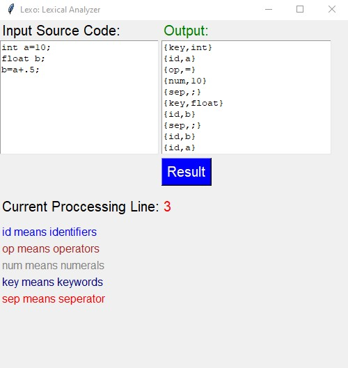

<h1 align='center'> Lexo </h1>

## Description

<p>
Lexical analysis is the first phase of a compiler. It takes modified source code from language preprocessors that are written in the form of sentences. The lexical analyzer breaks these syntaxes into a series of tokens, by removing any whitespace or comments in the source code.
</p>

<p>
If the lexical analyzer finds a token invalid, it generates an error. The lexical analyzer works closely with the syntax analyzer. It reads character streams from the source code, checks for legal tokens, and passes the data to the syntax analyzer when it demands.
</p>

## How to use 

1. Clone the repository and change the directory

```bash
git clone https://github.com/mishra1683/Lexo.git
cd Lexo
```

2. Create a virtual environment

```bash
pip install virtualenv
virtualenv lexo_env
source lexo_env/bin/activate
```

3. Install the required libraries

```bash
pip install -r requirements.txt
```

4. Run the python file

```bash
cd src
python3 Lexo.py
```

## Example



## Contributors

1. <a href="https://github.com/us4544">Umang Shringi</a>
2. <a href="https://github.com/mishra1683">Aditya Mishra</a>
3. <a href="https://github.com/archihalder">Archi Halder</a>